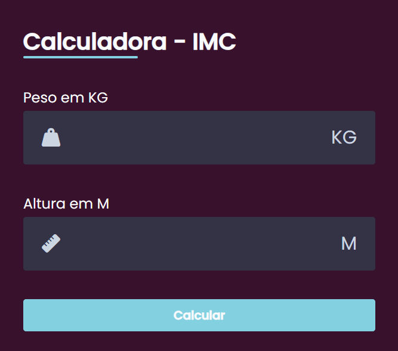
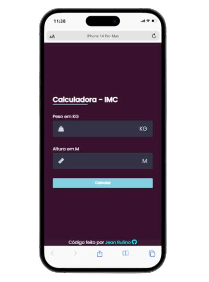

# Landing page 🖥
<p align="center">

</p>

## 📖 Sobre   
O projeto dessa calculadora de imc, foi com estudos para eu me aperfeiçoar, e começar uma nova linguagem (js). Foi um projeto cansativo, quis me otimizar ao máximo no html principalmente, para deixar organizado, e ultilizei outros metódos de medições no css, troquei o px por rem em algumas sintaxes, além de fazer um script de submit. A calculadora é 100% funcional, e testada
---

## 🚀 Tecnologias e ferramentas utilizadas
 - **HTML5**
 - **CSS3**
 - **JAVASCRIPT**

---

## 🖥️ Demonstração




Você pode acessar o projeto clicando [aqui](https://jeanruf1.github.io/clipboard-landing-page-master/).

---

## 🔧 Como executar o projeto

```bash
# Clone o repositório
git clone https://jeanruf1.github.io/calculadoraimc//

# Entre no diretório
cd landing-page-master
```
Depois disso, utilize uma ferramenta como o [Live Server](https://marketplace.visualstudio.com/items?itemName=ritwickdey.LiveServer) para criar um servidor local e executar o projeto.

----

**Desenvolvido com ❤️ por [Jean Rufino](https://github.com/jeanruf1/).**
